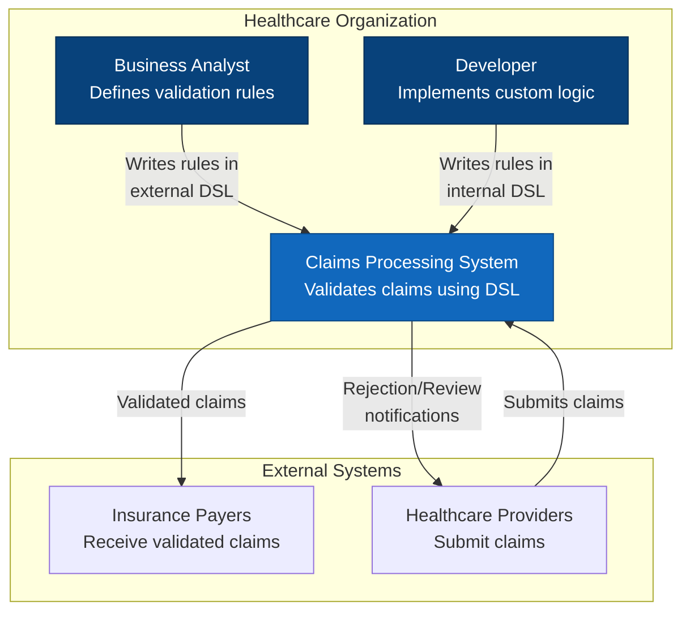
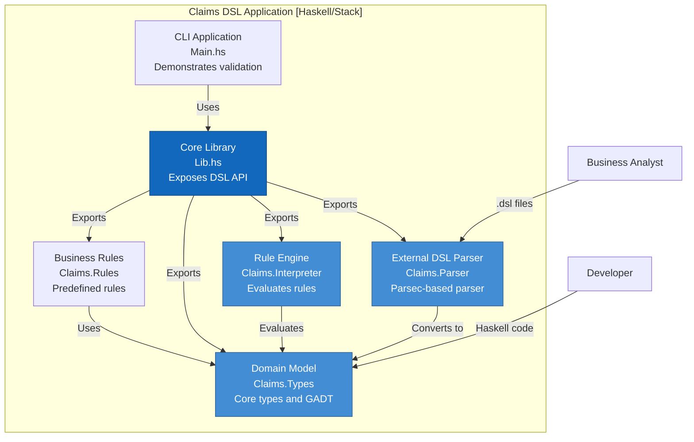
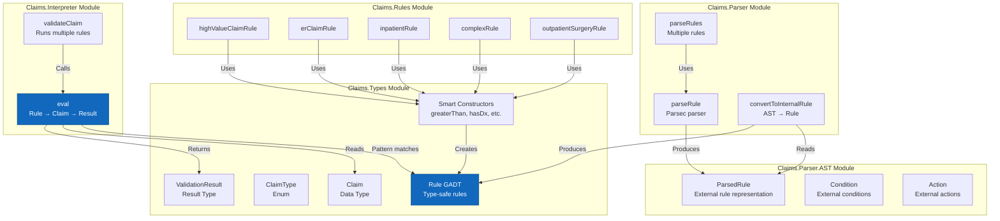
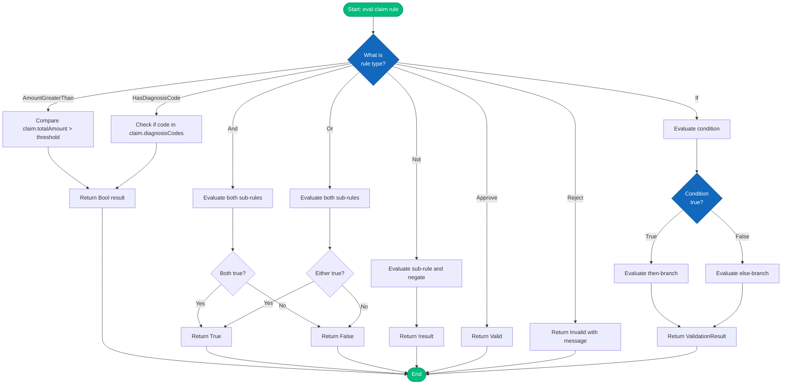
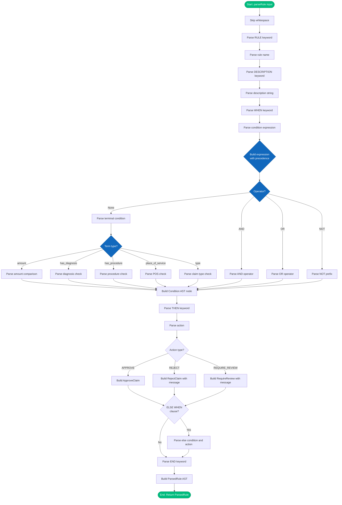
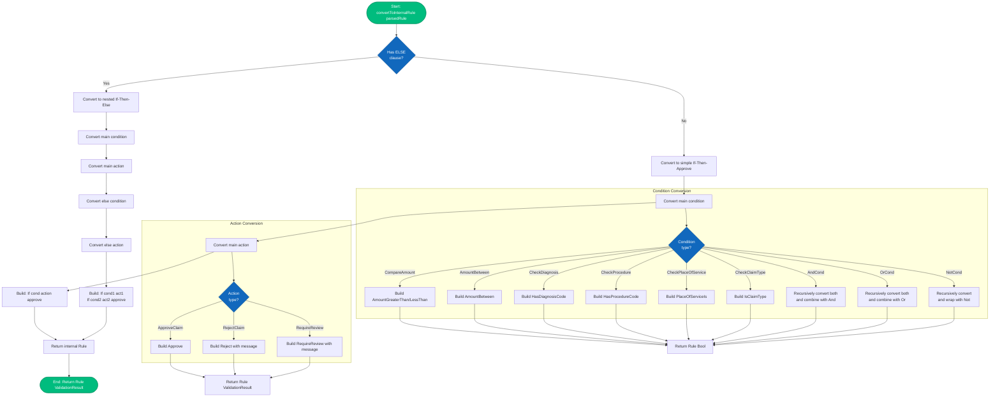
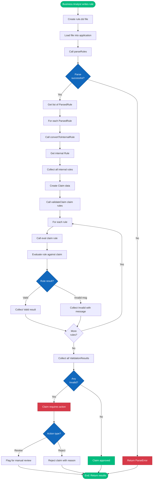
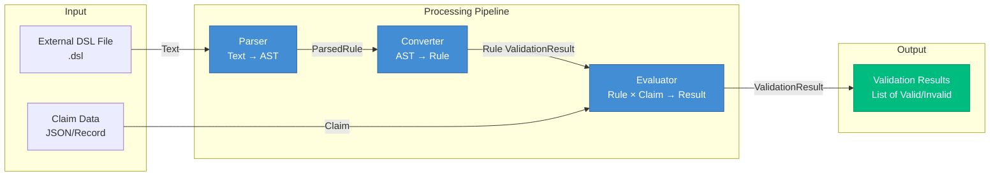
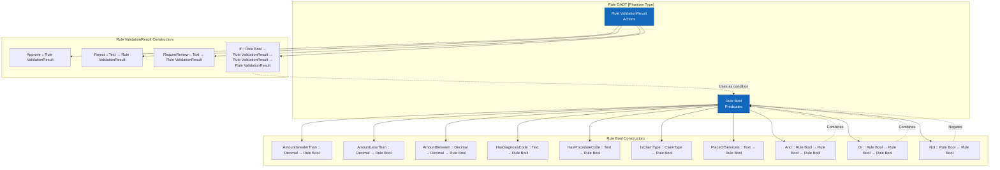
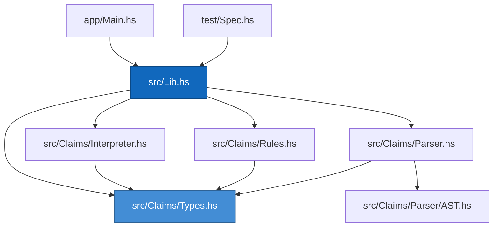

# Architecture Documentation

This document provides C4 model diagrams for the Healthcare Claims X12 Processing DSL application using Mermaid.

## C4 Model Overview

The C4 model provides different levels of abstraction:
- **Level 1: System Context** - How the system fits in the world
- **Level 2: Container** - High-level technology choices
- **Level 3: Component** - Components within containers
- **Level 4: Code** - Implementation details (classes, functions)

---

## Level 1: System Context Diagram

Shows how the Claims DSL system fits into the healthcare claims processing ecosystem.

---

## Level 2: Container Diagram

Shows the high-level containers (applications/services) that make up the system.

---

## Level 3: Component Diagram

Shows the internal components and their relationships.

---

## Level 4: Algorithm Flow Diagrams

### 4.1 Rule Evaluation Algorithm

### 4.2 External DSL Parsing Algorithm

### 4.3 AST to Internal Rule Conversion Algorithm

### 4.4 Complete Validation Flow (End-to-End)

---

## Data Flow Diagram

Shows how data flows through the system:

---

## Type System Architecture

Shows the GADT-based type system:

---

## Module Dependency Graph

---

## Summary

This architecture demonstrates:

1. **Clear Separation of Concerns**: Each module has a distinct responsibility
2. **Type Safety**: GADT ensures compile-time correctness
3. **Extensibility**: Easy to add new rule types or conditions
4. **Composability**: Rules can be combined using logical operators
5. **Two-DSL Approach**: Internal (type-safe) and external (business-friendly)
6. **Clean Data Flow**: Text → AST → Internal Rule → Evaluation → Result
