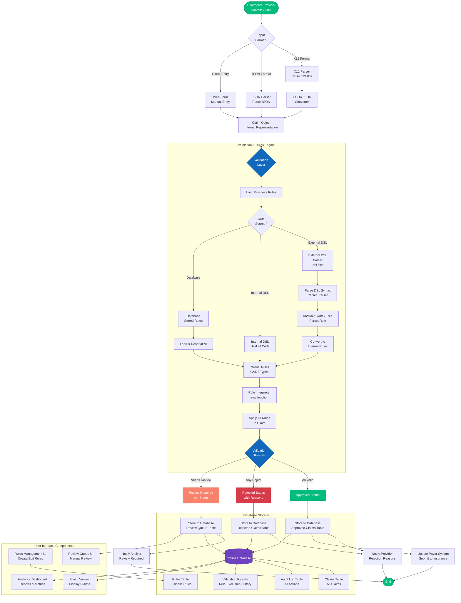
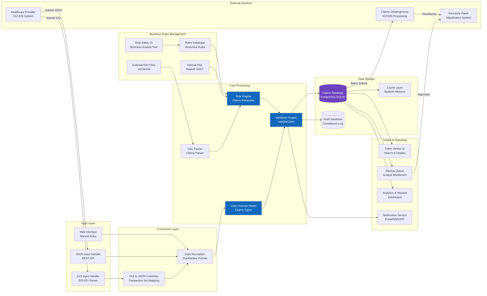
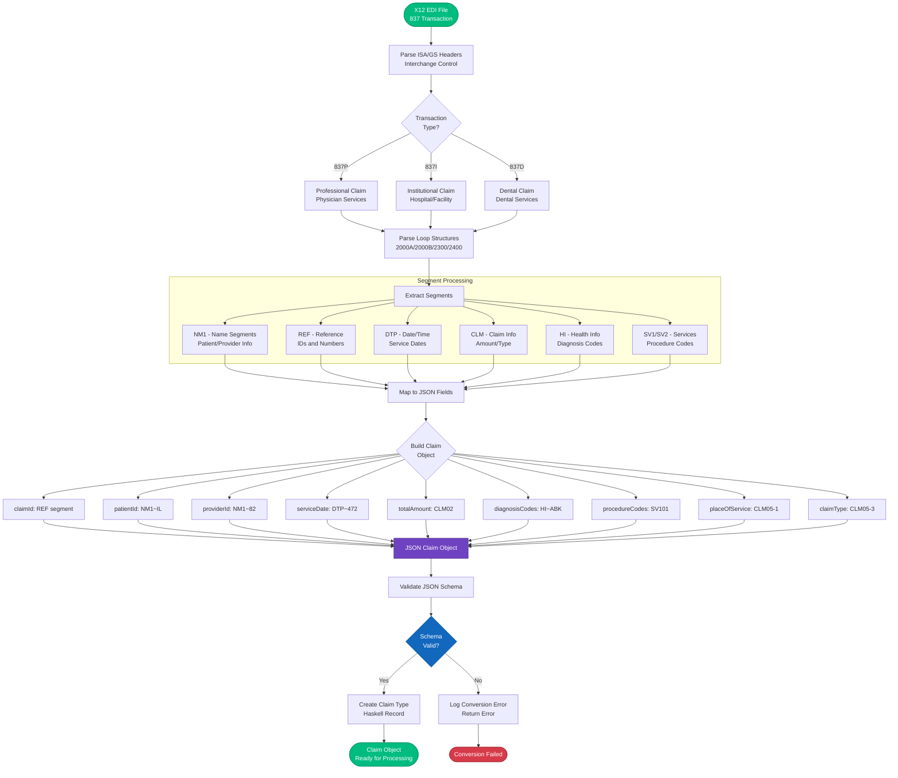
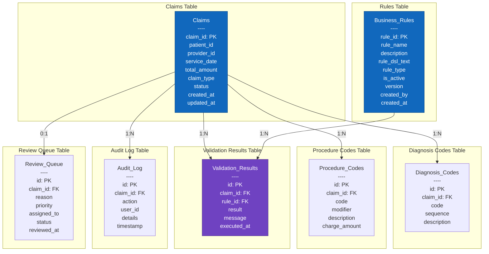
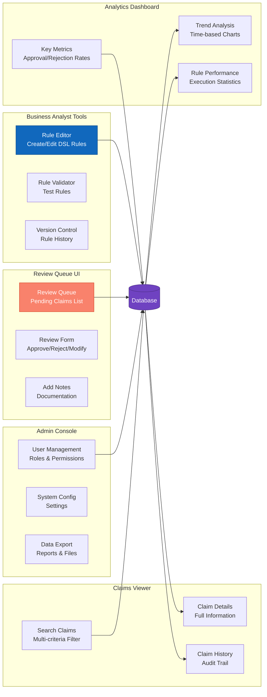

# Claims Processing System - Main Flow and Components

## Overview

This flowchart illustrates the complete flow of the Healthcare Claims X12 Processing System, showing how claims move through the system from initial input to final storage, including validation, business rules application, and data management.

---

## Main System Flow

---

## Component Architecture

---

## Business Rules Processing Flow

```mermaid
flowchart TD
    Start([Business Analyst<br/>Creates Rule]) --> RuleType{Rule<br/>Format?}
    
    RuleType -->|Text-based| WriteDSL[Write External DSL<br/>sample-rules.dsl]
    RuleType -->|Code-based| WriteHaskell[Write Haskell Code<br/>Internal DSL]
    RuleType -->|UI-based| UseEditor[Use Rule Editor<br/>Web Interface]
    
    WriteDSL --> SaveFile[Save .dsl File]
    WriteHaskell --> CompileCode[Compile Haskell]
    UseEditor --> SaveDB[Save to Database]
    
    SaveFile --> LoadTime[Load at Runtime]
    CompileCode --> LoadTime
    SaveDB --> LoadTime
    
    LoadTime --> ParsePhase{Parse<br/>Required?}
    
    ParsePhase -->|Yes - External DSL| ParseText[Parse DSL Text<br/>Parsec Parser]
    ParsePhase -->|No - Internal DSL| SkipParse[Use Directly]
    
    ParseText --> BuildAST[Build AST<br/>ParsedRule Type]
    BuildAST --> ConvertAST[Convert to Internal<br/>convertToInternalRule]
    ConvertAST --> InternalRule[Internal Rule<br/>Rule ValidationResult]
    SkipParse --> InternalRule
    
    InternalRule --> RuleLibrary[Rule Library<br/>Collection of Rules]
    
    RuleLibrary --> ApplyClaim[Apply to Claim<br/>eval claim rule]
    
    ApplyClaim --> EvalCondition{Evaluate<br/>Condition?}
    
    EvalCondition -->|Boolean Check| CheckPredicate[Check Predicate<br/>Amount, Dx, Px, etc.]
    EvalCondition -->|Logical Op| CombineRules[Combine Rules<br/>AND, OR, NOT]
    EvalCondition -->|Conditional| EvalIf[Evaluate If-Then-Else]
    
    CheckPredicate --> ReturnBool[Return Bool Result]
    CombineRules --> ReturnBool
    
    ReturnBool --> EvalIf
    EvalIf --> ThenBranch{Condition<br/>True?}
    
    ThenBranch -->|Yes| ExecuteThen[Execute Then Action]
    ThenBranch -->|No| ExecuteElse[Execute Else Action]
    
    ExecuteThen --> ActionType{Action<br/>Type?}
    ExecuteElse --> ActionType
    
    ActionType -->|Approve| ReturnValid[Return Valid]
    ActionType -->|Reject| ReturnInvalid[Return Invalid<br/>with Message]
    ActionType -->|Review| ReturnReview[Return RequireReview<br/>with Note]
    
    ReturnValid --> CollectResults[Collect All Results]
    ReturnInvalid --> CollectResults
    ReturnReview --> CollectResults
    
    CollectResults --> FinalDecision{Final<br/>Decision}
    
    FinalDecision -->|All Valid| ApproveClaim[Approve Claim]
    FinalDecision -->|Any Reject| RejectClaim[Reject Claim]
    FinalDecision -->|Any Review| QueueReview[Queue for Review]
    
    ApproveClaim --> End([Store Result])
    RejectClaim --> End
    QueueReview --> End
    
    style Start fill:#00bc7e,stroke:#009063,color:#ffffff
    style End fill:#00bc7e,stroke:#009063,color:#ffffff
    style EvalCondition fill:#1168bd,stroke:#0b4884,color:#ffffff
    style ThenBranch fill:#1168bd,stroke:#0b4884,color:#ffffff
    style FinalDecision fill:#1168bd,stroke:#0b4884,color:#ffffff
    style ApproveClaim fill:#00bc7e,stroke:#009063,color:#ffffff
    style RejectClaim fill:#d73a49,stroke:#a72630,color:#ffffff
    style QueueReview fill:#f9826c,stroke:#d4411e,color:#ffffff
```

---

## X12 to JSON Conversion Flow

---

## Database Schema & Storage

---

## User Interface Components

---

## Summary

This flowchart system illustrates:

1. **Main System Flow**: Complete end-to-end processing from claim submission to storage and notification
2. **Component Architecture**: How different system components interact
3. **Business Rules Processing**: Detailed flow of rule creation, parsing, and application
4. **X12 to JSON Conversion**: How EDI transactions are converted to internal format
5. **Database Schema**: Data storage structure and relationships
6. **User Interface Components**: Tools available to different user roles

The system supports:
- Multiple input formats (X12, JSON, Web forms)
- Flexible business rules (External DSL, Internal DSL, Database)
- Comprehensive validation and review processes
- Full audit trail and compliance logging
- Rich user interfaces for all stakeholders
